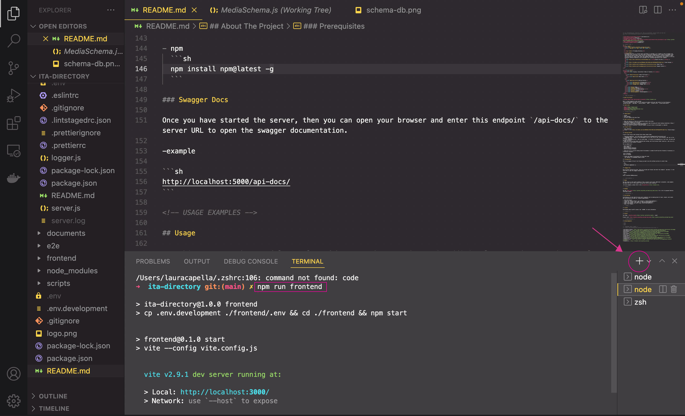

<!--
*** Thanks for checking out the Best-README-Template. If you have a suggestion
*** that would make this better, please fork the repo and create a pull request
*** or simply open an issue with the tag "enhancement".
*** Thanks again! Now go create something AMAZING! :D
***
***
***
*** To avoid retyping too much info. Do a search and replace for the following:
*** github_username, repo_name, twitter_handle, email, project_title, project_description
-->

<!-- PROJECT SHIELDS -->
<!--
*** I'm using markdown "reference style" links for readability.
*** Reference links are enclosed in brackets [ ] instead of parentheses ( ).
*** See the bottom of this document for the declaration of the reference variables
*** for contributors-url, forks-url, etc. This is an optional, concise syntax you may use.
*** https://www.markdownguide.org/basic-syntax/#reference-style-links
-->

[![Contributors][contributors-shield]][contributors-url]
[![Forks][forks-shield]][forks-url]
[![Stargazers][stars-shield]][stars-url]
[](https://github.com/it-academyproject/ita-directory/issues)
[![MIT License][license-shield]][license-url]
[![LinkedIn][linkedin-shield]][linkedin-url]

<!-- PROJECT LOGO -->
<br />
<p align="center">
  <a href="https://github.com/github_username/repo_name">
    
  </a>

  <h3 align="center">IT Academy Directory</h3>

  <p align="center">
    IT Academy Directory is a project built with React.js and Node.js for students at the IT Academy from Barcelona Activa. The goal is to allow them to familiarize themselves with a generic development setup that could be found in other places. One of the purposes of this project is to allow students to deal with new features, legacy code, fixes and teamwork challenges. As a consequence the priority is not only excellent technical execution, but to provide a full learning experience to our students. 
    <br />
    <a href="https://docs.itadirectory.eurecatacademy.org/"><strong>Explore the docs »</strong></a>
    <br />
    <br />
    <a href="https://xd.adobe.com/view/6889eb5a-76b3-4b9d-adcb-0d76da6a8789-3dda/flow/">Visual design</a>
    ·
    <a href="https://github.com/it-academyproject/ita-directory/issues">Report Bug</a>
    ·
    <a href="https://github.com/it-academyproject/ita-directory/issues">Request Feature</a>
  </p>
</p>

<!-- TABLE OF CONTENTS -->
<details open="open">
  <summary><h2 style="display: inline-block">Table of Contents</h2></summary>
  <ol>
    <li>
      <a href="#about-the-project">About The Project</a>
      <ul>
        <li><a href="#built-with">Built With</a></li>
      </ul>
    </li>
    <li>
      <a href="#getting-started">Getting Started</a>
      <ul>
        <li><a href="#prerequisites">Prerequisites</a></li>
        <li><a href="#installation">Installation</a></li>
        <li><a href="#swagger-docs">Swagger Docs</a></li>
      </ul>
    </li>
    <li><a href="#usage">Usage</a></li>
    <li><a href="#roadmap">Roadmap</a></li>
    <li><a href="#contributing">Contributing</a></li>
    <li><a href="#license">License</a></li>
    <li><a href="#contact">Contact</a></li>
    <li><a href="#acknowledgements">Acknowledgements</a></li>
  </ol>
</details>

<!-- ABOUT THE PROJECT -->

## About The Project

[![Product Name Screen Shot][product-screenshot]](https://example.com)

Here's a blank template to get started:
**To avoid retyping too much info. Do a search and replace with your text editor for the following:**
`github_username`, `repo_name`, `twitter_handle`, `email`, `project_title`, `project_description`

### Built With

- [React](https://reactjs.org/)
- [Nodejs](https://nodejs.dev/)
- [PostgreSQL](https://www.postgresql.org/)
- [Redis](https://redis.io/)

<!-- GETTING STARTED -->

### Requirements

1. Docker
2. Bash terminal
3. Git pull-request and issue flows.

### How to work with GIT

1. When new features or fixes are required we create a new issue.
2. Issues are assigned to one person.
3. The number of the issue is created as a new branch name following git branch naming conventions: https://deepsource.io/blog/git-branch-naming-conventions/
4. Once the issue is resolved, a new pull-request from your branch to development is required.

### Project files:

1. This repository
2. Visual: <a href="https://xd.adobe.com/view/6889eb5a-76b3-4b9d-adcb-0d76da6a8789-3dda/flow/">Visual design</a>

### Getting Started

To get a local copy up and running follow these simple steps.

1. Clone the repository: `git clone https://github.com/it-academyproject/ita-directory.git`
2. **TEMPORARY STEP**: Copy the .env.development file to a new .env in the _root directory_ and .env in the _./backend_ directory.
3. Install dependencies with: `npm run install-deps` _It installs the dependencies of the front, the back and the main directory_
4. Make sure that you have docker installed and running, and from the main folder launch up: `npm run up`(to initialize the local project in docker)

The up command will:

- Start PostgreSQL
- Start Redis
- Generate PRISMA migrations
- Seed the Postgres database

5. Once all of it is up and running launch the backend, to enable the API
   `npm run backend`

6. Open another terminal and launch the frontend with the command:
   `npm run frontend`



7. Now the project is setup and running on local enviroment.

8. In order to start contributing to the project and solvieng issues you must create and change to new branch for the issue number (#id) and the issue name, never work on main branch.
   `git checkout -b issueNumber-name-of-issue`

### Prerequisites

This is an example of how to list things you need to use the software and how to install them.

- npm
  ```sh
  npm install npm@latest -g
  ```

### Swagger Docs

Once you have started the server, then you can open your browser and enter this endpoint `/api-docs/` to the server URL to open the swagger documentation.

-example

```sh
http://localhost:5000/api-docs/
```

<!-- USAGE EXAMPLES -->

## Usage

Use this space to show useful examples of how a project can be used. Additional screenshots, code examples and demos work well in this space. You may also link to more resources.

_For more examples, please refer to the [Documentation](https://example.com)_

<!-- ROADMAP -->

## Roadmap

See the [open issues](https://github.com/github_username/repo_name/issues) for a list of proposed features (and known issues).

<!-- CONTRIBUTING -->

## Contributing

Contributions are what make the open source community such an amazing place to learn, inspire, and create. Any contributions you make are **greatly appreciated**.

1. Fork the Project
2. Create your Feature Branch (`git checkout -b feature/AmazingFeature`)
3. Commit your Changes (`git commit -m 'Add some AmazingFeature'`)
4. Push to the Branch (`git push origin feature/AmazingFeature`)
5. Open a Pull Request

<!-- LICENSE -->

## License

Distributed under the MIT License. See `LICENSE` for more information.

<!-- CONTACT -->

## Contact

Your Name - [@twitter_handle](https://twitter.com/twitter_handle) - email

Project Link: [https://github.com/github_username/repo_name](https://github.com/github_username/repo_name)

<!-- ACKNOWLEDGEMENTS -->

## Acknowledgements

- []()
- []()
- []()

<!-- MARKDOWN LINKS & IMAGES -->
<!-- https://www.markdownguide.org/basic-syntax/#reference-style-links -->

[contributors-shield]: https://img.shields.io/github/contributors/github_username/repo.svg?style=for-the-badge
[contributors-url]: https://github.com/it-academyproject/ita-directory/graphs/contributors
[forks-shield]: https://img.shields.io/github/forks/github_username/repo.svg?style=for-the-badge
[forks-url]: https://github.com/it-academyproject/ita-directory/network/members
[stars-shield]: https://img.shields.io/github/stars/github_username/repo.svg?style=for-the-badge
[stars-url]: https://github.com/github_username/repo_name/stargazers
[issues-shield]: https://img.shields.io/github/issues/github_username/repo.svg?style=for-the-badge
[issues-url]: https://github.com/it-academyproject/ita-directory/issues
[license-shield]: https://img.shields.io/github/license/github_username/repo.svg?style=for-the-badge
[license-url]: https://github.com/github_username/repo_name/blob/master/LICENSE.txt
[linkedin-shield]: https://img.shields.io/badge/-LinkedIn-black.svg?style=for-the-badge&logo=linkedin&colorB=555
[linkedin-url]: https://linkedin.com/in/github_username
